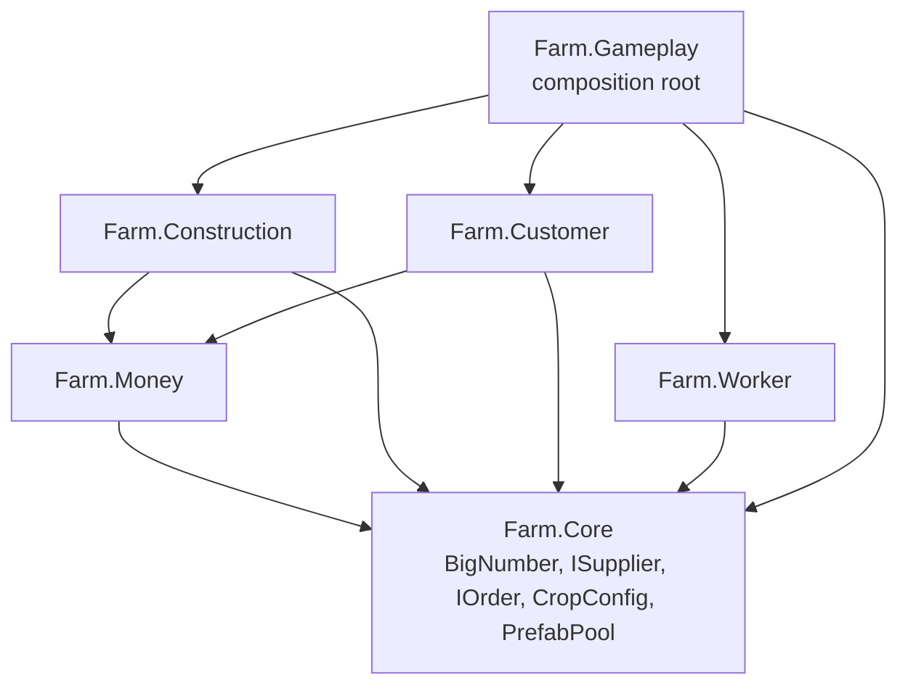

# System Architecture

Assembly dependency graph after decoupling Worker/Customer/Construction via `Farm.Core` interfaces (`ISupplier`, `IOrder`) and a `Farm.Gameplay` composition root.

## Notes
- `Farm.Construction`, `Farm.Customer`, `Farm.Worker` are independent siblings — none references another gameplay system's asmdef.
- `Farm.Gameplay` is the only assembly allowed to know about more than one gameplay system at once (`WorkerManager` matchmaking, `CustomerSpawnDirector` spawn gating).
- `Worker.cs` depends only on `Farm.Core`'s `ISupplier`/`IOrder` role interfaces, not on concrete `Construction`/`Customer` types.
- Gotcha: since every system namespace (`Farm.Construction`, `Farm.Customer`, `Farm.Worker`, `Farm.Gameplay`) is a direct child of `Farm`, a bare `Customer`/`Construction`/`Worker` identifier is ambiguous (namespace vs. same-named class) in any file that `using`s more than one of them — qualify as `Customer.Customer`, `Construction.Construction`, `Worker.Worker`.
